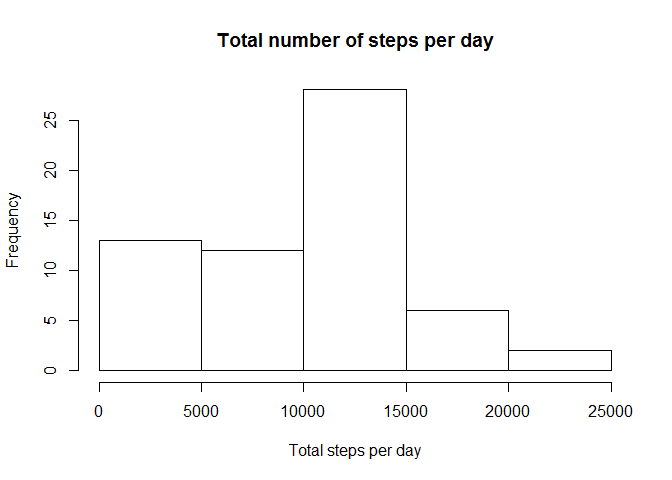
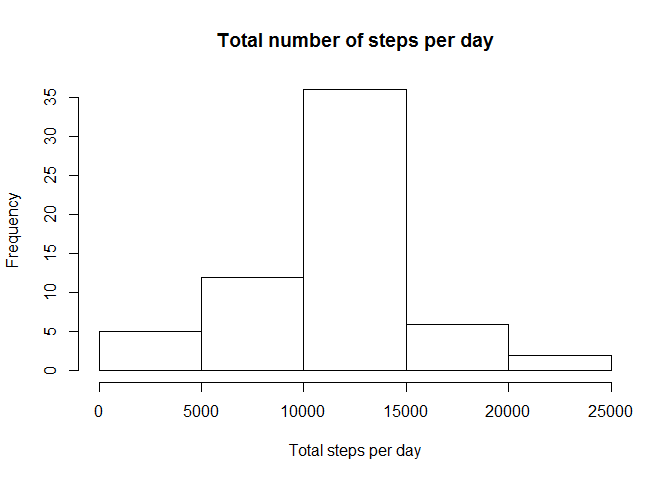
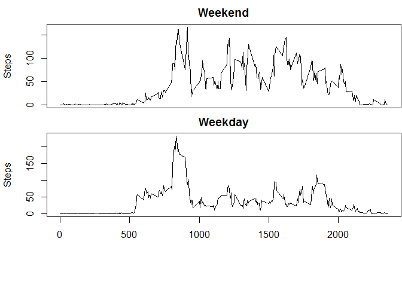

# Reproducible Research: Peer Assessment 1


## Loading and preprocessing the data
unzip the file

```r
unzip("activity.zip")
```

read into data table

```r
library(data.table)
stepData <- data.table(read.csv(file = "activity.csv",
                     colClasses = c("numeric","Date","numeric"),
                     stringsAsFactors = FALSE))
```


## What is mean total number of steps taken per day?

```r
dailySteps <- stepData[, list(total = sum(steps, na.rm = TRUE)), by = date]
hist(dailySteps$total, main ="Total number of steps per day",
     xlab = "Total steps per day")
```

\

```r
print(dailyMean <- mean(dailySteps$total))
```

```
## [1] 9354.23
```

```r
print(dailyMedian <- median(dailySteps$total))
```

```
## [1] 10395
```


## What is the average daily activity pattern?

```r
intAvg <- stepData[,list(average = mean(steps,na.rm = TRUE)), by = interval]
plot(x = intAvg$interval, y = intAvg$average,
     type = "l", xlab = "Interval", ylab = "Steps")
```

\

```r
intAvg[average == max(average)]
```

```
##    interval  average
## 1:      835 206.1698
```

## Imputing missing values
Total number of missing values:

```r
sum(is.na(stepData$steps))
```

```
## [1] 2304
```

Devise a strategy for filling in all of the missing values in the dataset.  
For each interval with missing value, insert the average for that interval.

```r
newAvg <- sapply(stepData[is.na(steps)]$interval,
                 function(x){intAvg[intAvg$interval == x]$average})
```

Create a copy of the data table and insert missing values.

```r
newStepData <- copy(stepData)
newStepData[is.na(steps), steps := newAvg]
```
Make a histogram of the total number of steps taken each day

```r
newDailySteps <- newStepData[, list(total = sum(steps, na.rm = TRUE)),
                             by = date]
hist(newDailySteps$total, main ="Total number of steps per day",
     xlab = "Total steps per day")
```

\
Calculate and report the mean and median total number of steps taken per day.

```r
print(newDailyMean <- mean(newDailySteps$total))
```

```
## [1] 10766.19
```

```r
print(newDailyMedian <- median(newDailySteps$total))
```

```
## [1] 10766.19
```
Do these values differ from the estimates from the first part of the assignment? What is the impact of imputing missing data on the estimates of the total daily number of steps?  
  
Imputing the missing values changed the distribution in the histogram, a less number of days had a smaller step count. The distribution became more like a normal distribution. The mean and median also increased.

## Are there differences in activity patterns between weekdays and weekends?

```r
stepWeekends <- weekdays(newStepData$date) %in% c("Saturday", "Sunday")
factorStepWeekends <- factor(stepWeekends,
                             levels = c(TRUE, FALSE),
                             labels = c("weekend", "weekday"))
newStepData[,weekend := factorStepWeekends]

intAvgWeekend <- newStepData[weekend == "weekend",
                             list(average = mean(steps,na.rm = TRUE)),
                             by = interval]

intAvgWeekday <- newStepData[weekend == "weekday",
                             list(average = mean(steps,na.rm = TRUE)),
                             by = interval]

par(mfrow=c(2,1),
    mar = c(0,4,2,0) + 0.1,
    oma = c(6,0,0,0))

plot(x = intAvgWeekend$interval,
     y = intAvgWeekend$average,
     type = "l",
     main = "Weekend",
     xlab = "Average 5-minute interval",
     ylab = "Steps",
     xaxt='n',
     mar = c(0,4,4,0))

plot(x = intAvgWeekday$interval,
     y = intAvgWeekday$average,
     type = "l",
     main = "Weekday",
     xlab = "Average 5-minute interval",
     ylab = "Steps")
```

\

